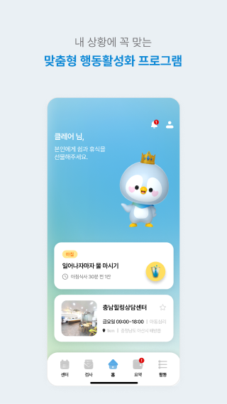
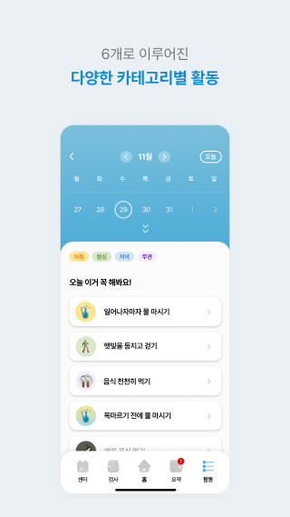
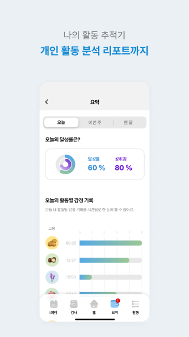
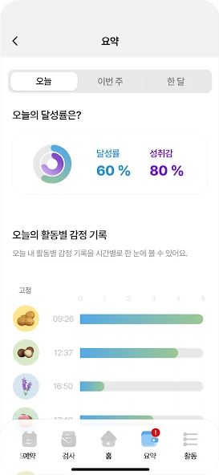
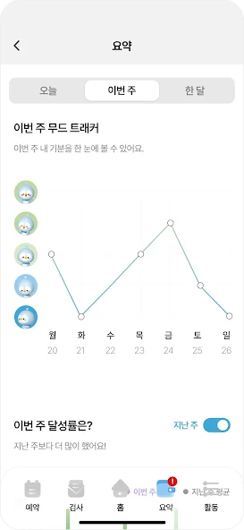

* ___해당 프로젝트는 비밀 유지 계약에 따라 코드를 공개할 수 없습니다.___
* ___그래서 일부 기능만 업로드했습니다.___

<h1 align="center">Tunegem</h1>  

## IntroDuction

Company : Turingbio  
Desc : BA 활용 디지털 치료 지향 서비스(Lite Version).
주요 기능 : 감정 선택, BA 추천, 상태 모니터링, 심리 상담 센터 소개

<table>
   <tr>
      <td>
         
      </td>
      <td>
         
      </td>
      <td>
         
      </td>
      <td>
         
      </td>
   </tr>
    <tr>
        <td>
          
        </td>
        <td>
          
        </td>
        <td>
          
        </td>
        <td>
          
        </td>
    </tr>
</table> 

### 🧑‍💻 프로젝트내 담당 업무

* ___해당 프로젝트는 전임 개발자의 Legacy와 유료 Library를 활용해 서비스가 중단되었었음___
* ___그래서 서비스 작동 및 버그 축소를 위한 개발만 진행함.___

 <pre>
 ㆍ Component, Page 재개발  
 ㆍ Util 분리 및 재개발(Permission, Notification, DeviceInfo등)  
 ㆍ Naver Map 관련 지도 기능 개발  
 ㆍ Syncfusion 관련 모든 Library 제거 및 새로 개발 -> Calendar, Graph등
 ㆍ GA 추가
 </pre>

  

### 협업 Tool

### CI/CD

